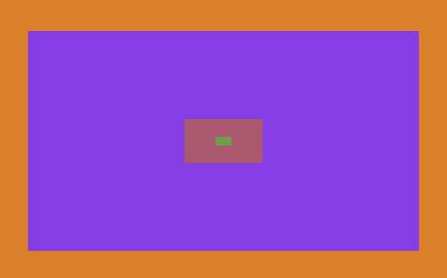

<p align="center">
  
</p>

# infinite-z-scroll

- ➰ Infinite scroll on the z axis
- ♻️ Stack of nested div with push/pop mechanism on scroll
- 🎲 Random generated background color
- ⚡ Use Vite for fast developement & build
- 🌟 JS/HTML/CSS only

## Prerequisite
* [Node](https://nodejs.org/en/)
* [Vite](https://github.com/vitejs/vite)

## Getting started
1. Clone this repo
2. Install
```bash 
npm install
```
3. Run for development (with hot reload)
```bash 
npm run dev
```
4. Build ( => /dist)
```bash 
npm run build
```

## Demo
https://sebbmn.github.io/infinite-z-scroll/

## License
MIT
